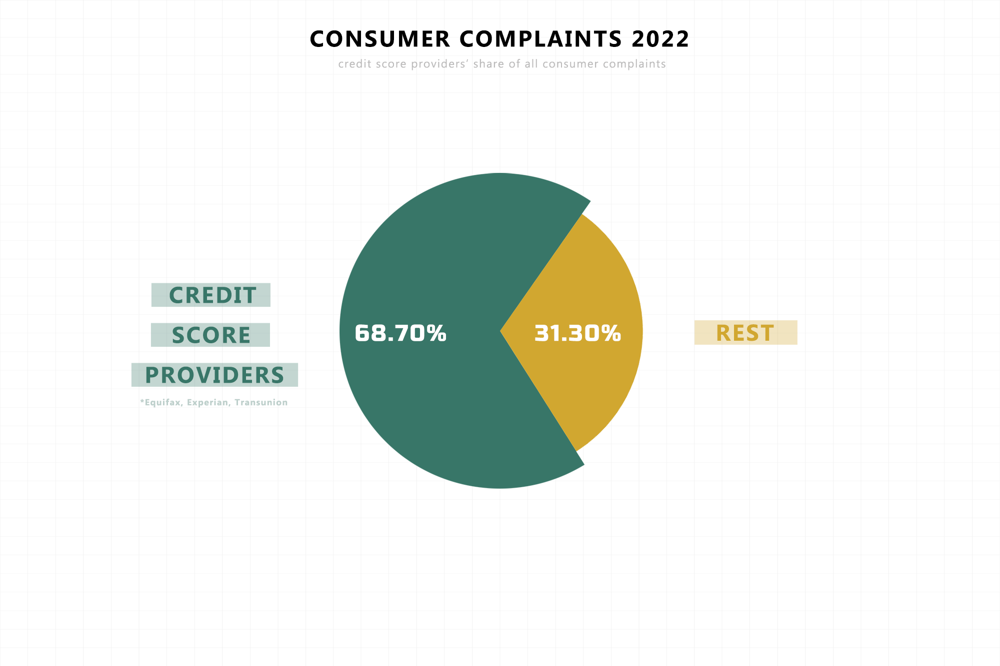
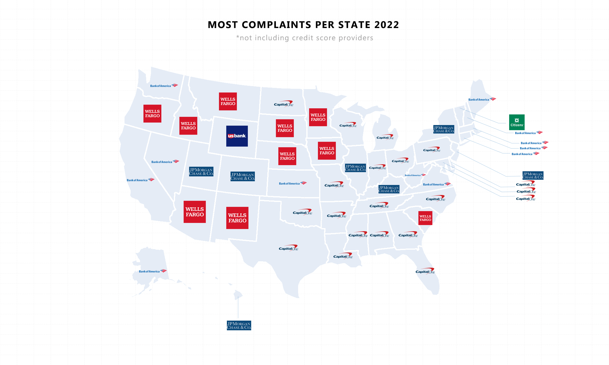
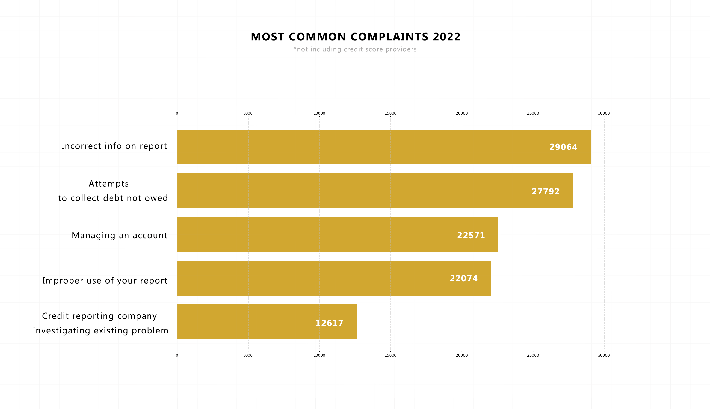
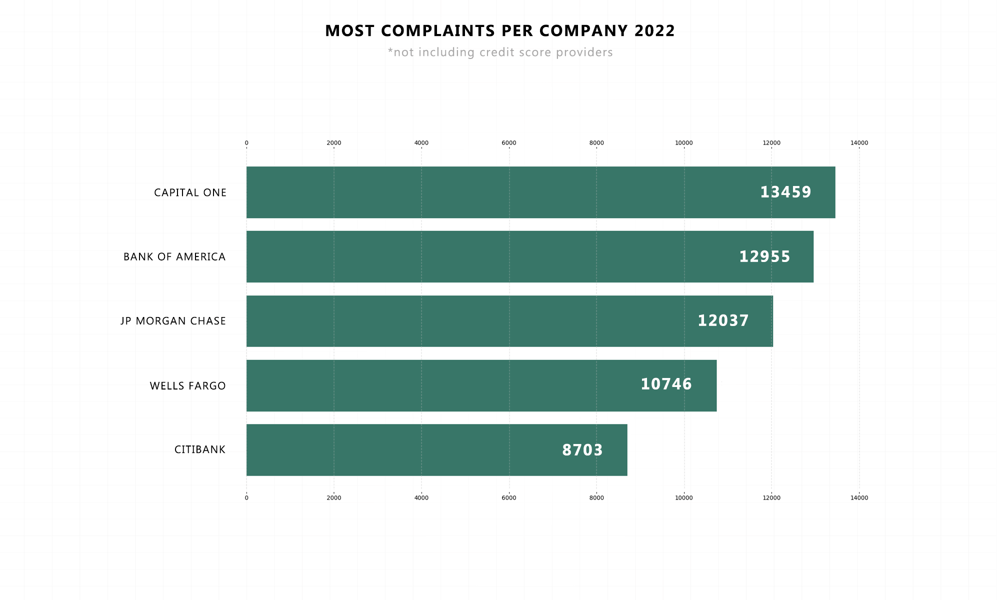

<strong>ABOUT</strong> 
 
Consumer financial complaints in the US for 2022 were primarily centered around credit score providers and banks. According to data, credit score providers such as Equifax, Experian, and TransUnion accounted for nearly 69 percent of all complaints during that year.

When excluding credit score providers and focusing on the remaining institutions, banks emerged as the main subject of consumer grievances. Major banks like Capital One, Wells Fargo, Bank of America, and JP Morgan Chase dominated the US financial landscape. Among these banks, Capital One received the highest number of complaints in 2022.

Data set provided by: https://catalog.data.gov/dataset/consumer-complaint-database

<strong>HOW TO NAVIGATE THIS REPO?</strong> 
 
I've got three folders in this repo: 
1. The main_data covers the main data sheet and cleans it a bit. 
2. complaints_2022 folder features files to write file for 2022 and get all necessary info for this year.
3. assets contains all the graphs

<strong>WHAT HAVE I COVERED?</strong> 
 
1. Credit score providers share of complaints for 2022
2. Most complaints per state 2022
3. Most common complaints 2022
4. Most complaints per company (*excluding credit score providers) 2022

<strong>SCREENSHOTS</strong>

